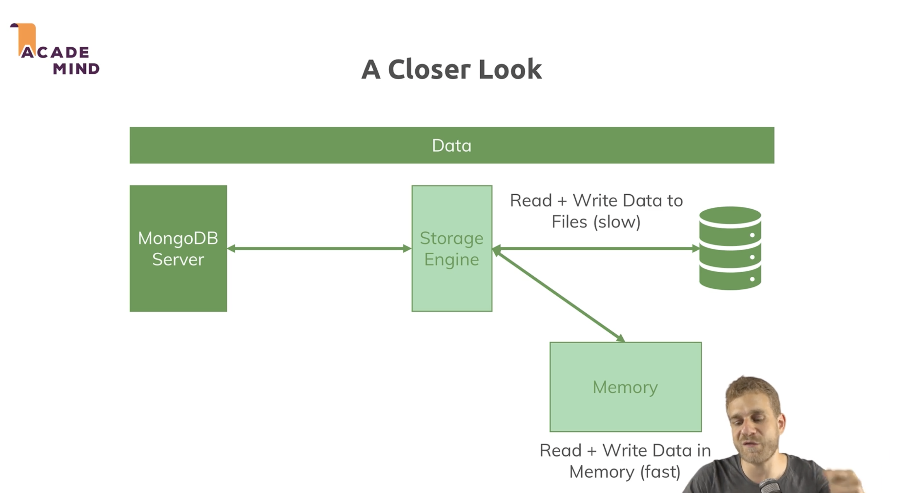

# MongoDB Notebook

## Introduction to MongoDB

- MongoDB is a database more specifically a NoSQL database. MongoDB is also the name of company who built it.
- MongoDB, the name came from the word 'Humongous' because this database is built to store lots and lots of data. You can store a lot of data and then you can also work with them efficiently.
- The following terminologies differs in NoSQL databases like MongoDB from SQL databases like Oracle, MySQL and Postgres:
  - SQL: Tables, NoSQL: Collections
  - SQL: Records, NoSQL: Documents
- It uses JSON (BSON) notation to store data as documents inside collections in MongoDB. Behind the scenes on the server, MongoDB converts our JSON data to a binary version of it which can basically be stored and queried more efficiently so some people call it BSON instead of JSON.
- Unlike SQL, in NoSQL collections are schema-less and this is the flexibility (flexibility to grow with your application and its needs) NoSQL databases like MongoDB gives you where SQL databases are very strict about the data you have to store in there.
- Another advantage of MongoDB is can store nested data as it uses JSON. This allows it to create complex relations between data and store them in one and the same document - which allows working and fetching data from it efficiently and also allows to store data in a logical way. In SQL databases we need to write complex joins and sub-queries to fetch data from different tables.

## Characteristics of MongoDB

- It is a NoSQL database and it has no schema. Instead of normalizing data which means storing it, distribute it across multiple tables where every table has a clear schema and then using a lot of relations, MongoDB goes for storing data together in a document and it also does not enforce a schema for you i.e. if we have multiple documents in a single collection they can have different structures. So as an advantage you can use MongoDB for apps that might still evolve, where the exact data requirements are just not set yet, you can get started and always add data with more information in the same collection at a later point of time.
- It has no / few relations i.e. less collections and within that you store data together. So instead of merging one table with another, MongoDB can query and get the results more efficiently.
- Popular use-cases for MongoDB is read/write heavy applications, applications with a lot of workload, applications that store a lot of data (i.e. smart devices which send some sensor data every second), building an online shop or blog.

## MongoDB (company) Ecosystem

- MongoDB database
  - Enterprise Server and Community Server
  - CloudManager / OpsManager (Tools for system admin or database admin to manage database)
  - Atlas (Cloud solution, all the managing a system admin would have to do is done for us there, so that we can focus on our data and logic there)
  - Mobile (One can install MongoDB on a mobile device, store data there and work without an internet connection)
  - Compass (GUI tool to connect to database and have a look at the data from there)
  - BI Connectors (Data science tool)
  - MongoDB Charts (Data science tool)
- Stitch (Serverless backend solution)
  - Serverless Query API (A tool which we can use ot efficiently query our database directly from inside our client side app - react/angular app)
  - Serverless Functions (Allows us to execute code in the cloud on demand, equivalent to AWS Lambda and Google Cloud functions)
  - Database Triggers (Service that allows us to listen to events in a database. Like if the document gets inserted, then execute a function to send an email to the customer in response to that)
  - Real-time Sync (Built to synchronize a database in a cloud with that mobile offline supporting database)

## Command to Install MongoDB in Mac

- Use the 'tap' command to download the official Homebrew formula for MongoDB and the Database Tools:  
`brew tap mongodb/brew`
- Use the following command in your macOS terminal to install MongoDB:  
`brew install mongodb-community`
- Change default database and log path for MongoDB:  
`vim /usr/local/etc/mongod.conf`
- Automatically start MongoDB server at login:  
`brew services start mongodb/brew/mongodb-community`
- Stop automatically startup of MongoDB server at login:  
`brew services stop mongodb/brew/mongodb-community`
- Command to manually run MongoDB server with the default database and log path:  
`mongod --config /usr/local/etc/mongod.conf`
- Command to manually run MongoDB server with custom database and log path:  
`mkdir -p ~/development/mongodb/data ~/development/mongodb/logs`  
`mongod --dbpath ~/development/mongodb/data --logpath ~/development/mongodb/logs/mongo.log`
- Command to connect to MongoDB server:  
`mongosh` (Note: Ensure that MongoDB server is running before attempting to start the mongosh shell)

## MongoDB Driver Downloads

- Drivers are packages we install for our app which may be written in the different programming languages and these drivers are then work as a bridge between your programming language and the MongoDB server.
- <https://docs.mongodb.com/drivers/>

## Basic MongoDB queries

- Lists all the existing databases that are currently running on the database server (when started fresh it will show 3 databases which will store some metadata):  
`> show dbs`

    ```m
    admin     41 kB
    config  61.4 kB
    local   73.7 kB
    ```

- To display the database you are using (operation may return test, which is the default database):  
`> db`

    ```m
    test
    ```

- We can switch to a database with the 'use' command and we can even switch to non-existing databases. But, in the second case the database won't be created before we start entering data in there. Once we do start entering data, such as by creating a collection, MongoDB will automatically and implicitly create the database so that we don't have to create the database in advance. To switch to a database:  
`> use shop`

    ```m
    switched to db shop
    ```

- Create a collection on the fly and insert a document in it:  
`> db.products.insertOne({ name: "A Book", price: 12.99 })`  
`> db.products.insertOne({ name: "A T-shirt", price: 29.99, description: "A new branded T-shirt" })`  
`> db.products.insertOne({ name: "A Computer", price: 1299.99, description: "A latest high quality gaming computer", details: { cpu: "Intel i7 8770", memory: 32 }} )`

    ```m
    {
        acknowledged: true,
        insertedId: ObjectId("61a2d3573020a42e0968c3e9")
    }
    ```

  __Note__:
  - db refers to the database currently connected to, in this case its 'shop'.
  - You can omit the quotation marks around the key name, not around the value because value is a text and quotation mark should be there around the text.
  - The output shows that the data was inserted into the database and also shows automatically generated the unique ID by MongoDB for it.

- List all the data in the collection  
`> db.products.find()`

    ```m
    [
        {
            _id: ObjectId("61a2d3573020a42e0968c3e9"),
            name: 'A Book',
            price: 12.99
        },
        {
            _id: ObjectId("61a2d6173020a42e0968c3ea"),
            name: 'A T-shirt',
            price: 29.99,
            description: 'A new branded T-shirt'
        },
        {
            _id: ObjectId("61a2d6b73020a42e0968c3eb"),
            name: 'A Computer',
            price: 1299.99,
            description: 'A latest high quality gaming computer',
            details: { cpu: 'Intel i7 8770', memory: 32 }
        }
    ]
    ```

## A Big Picture of MongoDB Working with the Clients


